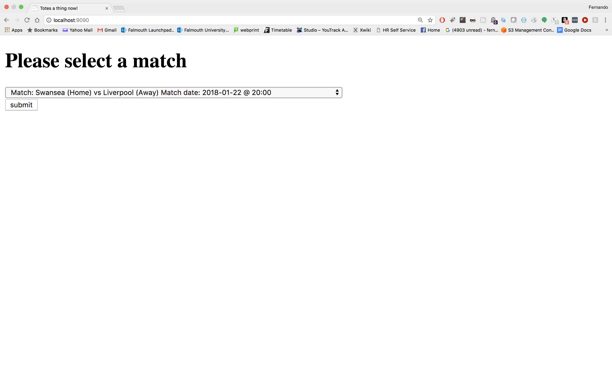
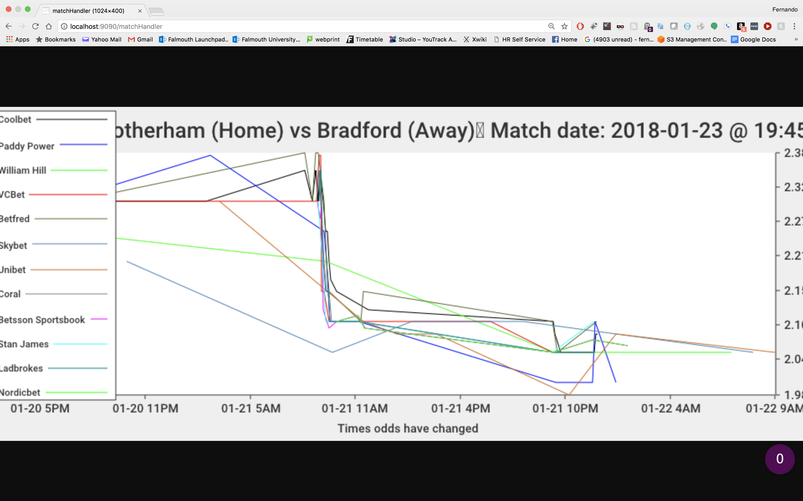

# Texas Odds for Rush Partners application

## Introduction:
So the Texas Odds api digestion is written in GOlang 1.6 by Fernando Pombeiro. It does two things currently: 
1. It creates visualizations (via a webserver) of how the odds have changed over time for each of the different bookmakers (Paddy Power, Ladbrokes, Nordicbet, etc...)
2. It _can_ move data into a database of the users' choosing. That database can exist on localhost, AWS, google, whatever for future data science application. There is a ddl included to allow the user to set everything up on his/her localhost.

## Components 
The components are pretty standard- it is broken into 6 packages so far:
1. **apiinterface**: basically the code that actually interfaces with the api
2. **myconfig**: the config file is json and is not in the repo for security reasons.
3. **dbconnection**: for ingestion into a database. The DDL will go up soon.
4. **transformations**: code to transform data from the api for both the visualization and database layers
5. **visualizations**: the visualizations code. I am working with a GO native charting package known go-charts. 
6. **maintxodds.go**: the "main" file and entrypoint to the application.

## So how does it work?
First off, of course, you will need Golang installed on your system. I would recommend using your local system package installer (big fan of [homebrew](https://brew.sh/) myself). From there follow the directions in [this setup](https://golang.org/doc/install)
From there it's simply a matter of cloning this package into your $GOPATH and running the following command: 
```
go run maintxodds.go
```
This will bring up a local server on localhost 9090 and from here you should see a drop down selection menu like this one:



From here you select a match and basically a chart will pop up showing the changes in match odds over time.
CURRENTLY there is no easy navigation back to the main page but I have that in my #TODO. Until then just hit the back button. 
Here is a chart sample:



## So what does the future hold? 
So ideally there are a few things I would like to do: 
1. First off- obviously the front end needs a _lot_ of work. Some sort of async javascript framework- like Angular or express or react would do a lot to make this a more bearable front end and reduce server calls. This could be a lot more user friendly.
2. Speaking of the front end- I need to be able to show multiple charts on a single page- which is do-able but I haven't had the time investment to put into it. Once I do we should be able to see the "Home" and "Opposing" teams' charts. 
3. I need to assign some sort of GoRoutines so that this application automatically ingests the data into a pg database somewhere (I am thinking google cloud since it offers GO support). 
4. Once I have goroutines assigned I would like to dockerize this application and then set it to run every 10 seconds or so. To do this I will need to use the "last_updated" flag that is emphasized in the documentation.
5. Obviously this needs to be deployed somewhere. 
6. Need to do some data science on the data that we are gathering (probably predictive analytics) to compare bookmakers.
7. Unit tests need to be added (I should know better by now). 
8. Effective logging needs to be added (currently it's in myconfig and just does a println)
9. I need to clean up the error where if a bookmaker has only one value the json does not unmarshal into a struct. I can fix this with interfaces- just need to hit it on my second pass. 

## TODOS:
My next step is to tackle #4 above first. 
